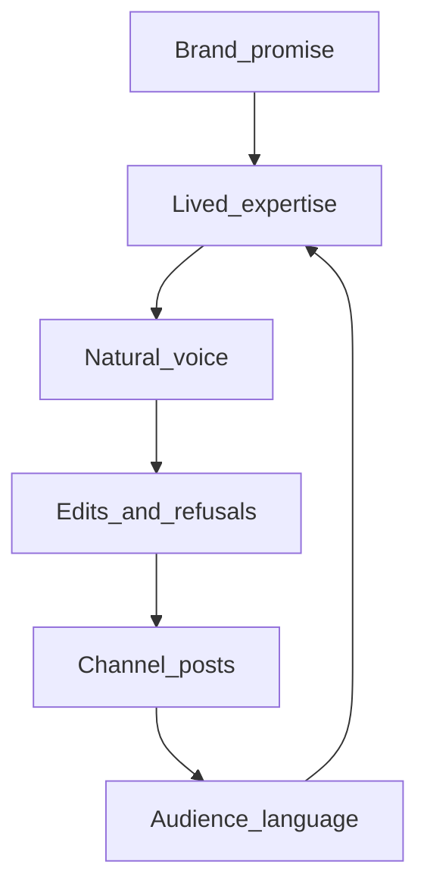
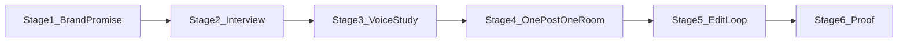
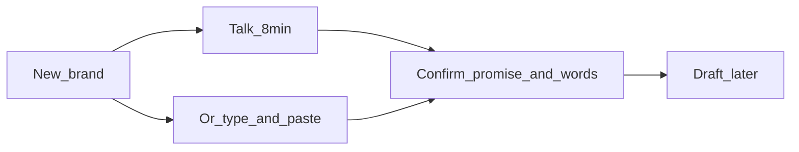

# The user is the product

Generic AI social tools compete on volume. They all sound the same. [Content Marketing Institute](https://contentmarketinginstitute.com/)’s current teaching is the opposite: **valuable, relevant, consistent content from a clearly defined point of view** — and the unique ideas already live **inside the person/company**, not in a prompt.

Our USP is not “we post to Instagram, LinkedIn, and Facebook.” Our USP is: **we get more of the user onto the feed than they could write themselves, without turning them into a full-time content creator, and without the AI-expertise illusion.**

If a stranger could have generated the post, we failed. If their customer would recognize *them*, we won.

## What CMI is actually teaching (site map, product-relevant)

CMI organizes the practice the same way a serious product should:

- **Strategy and planning**: audience, operations, thought leadership, demand — not random posts
- **Creation and distribution**: social, video, AI tools, promotion — channel is a *placement* decision
- **Measurement**: trust, reuse, influence — not vanity clicks
- **Research**: B2B/B2C benchmarks; AI is a tool, not the story
- **Education**: speak plainly; know the industry and the business

Headline ideas that should drive *our* product (not their conference):

- **Definition** ([What is content marketing](https://contentmarketinginstitute.com/what-is-content-marketing)): attract a defined audience with useful content; sell after you help. Four business outcomes — sales, cost savings, better customers, content as a profit center.
- **SMEs, not writers** ([Get great content without asking SMEs to write](https://contentmarketinginstitute.com/content-marketing-strategy/content-subject-matter-experts)): the user is the expert. Capture conversations (what customers get wrong, what they changed their mind about, advice they give that was never published). **Give AI the interview, not the assignment.** AI at the start can only remix the public internet; that is the expertise illusion.
- **Do not multiply junk**: one insight may be a LinkedIn post, another a 60-second clip, another sales ammo. Reach ≠ relevance. Channel fit is strategy.
- **Human relationships beat algorithms** ([Direct audience relationships](https://contentmarketinginstitute.com/audience-building/build-direct-audience-relationships)): listen, show up as a person, personal accounts beat faceless brand accounts, own a relationship (not only rented reach). “Resource the voices that already have trust.”
- **Plain speech is proof of knowing** ([Speak plainly](https://contentmarketinginstitute.com/training-education/marketers-speak-plainly-remove-jargon)): jargon hides missing knowledge. Use the buyer’s sentence, not “GTM motion.”
- **Thought leadership pays when it is real** ([IBM / CMI workshop](https://contentmarketinginstitute.com/strategy-planning/thought-leadership-roi)): executives buy because of distinctive POV, not because of more captions.
- **Social that works** (CMI social hub): listen to the platform, employee/personal branding, less robotic company pages, original proof — not “safe” B2B mush.
- **AI as partner with context** ([How top marketers write AI prompts](https://contentmarketinginstitute.com/ai-content-creation-tools/write-ai-prompts)): role + context + example + style; guardrails; conversation. Same as our product: never a blank “write a post.”
- **Stalling content** (CMI workshop): more calendar and more volume is not the fix. Audience needs after the post is the gap.

## The moat: get the most out of the user

Competitors can copy models. They cannot copy **this user’s** 15 years of pattern-matching, customer objections, and how they actually talk.

We harvest four layers. Each layer is harder for a rival to fake.

**1. Brand promise (strategy, not a logo)**  
Who they help, what they actually sell, who they refuse, what “winning” looks like. This is CMI’s documented strategy in one page. Without it, posts are spam with a nicer caption.

**2. Lived expertise (the interview)**  
The gold is not “professional and friendly.” It is:

- unusual customer questions
- failed implementations
- industry claims they disagree with
- the sentence a real buyer used for the problem

Product job: make capture cheap — paste old posts, short answers, later talk-to-text / connected-account history. They stay the expert; we do the writing job.

**3. Natural voice (how they sound)**  
Rhythm, POV, slang, emoji, humor, length. CMI: be a human, not a marketing machine. We study *their* corpus so the post would pass a “did you write this?” test from a colleague.

**4. Taste (how they correct us)**  
Every edit is a preference they could not articulate in a form. Keep, drop, rewrite, “too salesy,” “not how I talk.” That compounding taste is the switching cost. After 50 edits, ChatGPT-from-scratch cannot replace us.

**5. Audience language (optional later, still product)**  
Comments, DMs, what they save. CMI: listen, then change. The user becomes USP *and* the audience co-authors vocabulary.

## “Like them, but much better”

Better does **not** mean more corporate, more hashtags, or more AI polish.

Better means we keep **their** knowing and **their** mouth, then raise the parts experts are bad at:

- first line that earns the scroll
- one idea per post (not 27 recycled clones)
- the right channel for that idea
- a clear next step in their own words
- cut jargon they use when they feel “marketing”

If we overwrite their voice, we destroy the USP. If we copy their rambling, we waste the USP.

## Channels: placement, not spray

Instagram, LinkedIn, Facebook (and later owned channels) are **rooms**, not the product.

- Same expertise, different usefulness
- LinkedIn often wants a point of view and proof
- Instagram often wants a felt moment and a tight caption
- Facebook often wants conversation

Personal-first when the user *is* the brand (CMI: personal accounts outperform faceless handles). Brand-first when they run a company page. Preferences are per **user × brand × channel**.

We do not win by posting everywhere. We win by putting the right expert sentence in the room where it helps.

## How we achieve this (do not rush)

We do not ship “study the user + all channels + better posts” as one leap. We earn the USP in **stages**. Each stage is usable on its own. Later stages only start when the earlier one has something real to work with.

Rule for every stage: **the user stays the expert; we do the writing and placement job.** If we do not yet have their words, we do not generate a persona.

### Stage 1 — Brand as a one-page promise

**What we need from them (short, not a marketing textbook):**

- Who they help
- What they actually do / sell
- Who they are *not* for
- Topics they will never touch
- What a good week of content would change (leads, trust, bookings — their words)

**How we get it:** one recorded conversation can fill this (see audio-first below), then they confirm the fields. Typing the Promise tab remains a fallback. Replace “brand voice = professional and friendly” as the hero.

**Done when:** a stranger could read the page and know *who this is for*. Until then, generation is blocked or heavily warned.

### Stage 2 — The interview (lived expertise)

We do not ask them to write posts. We ask **five sharp questions**, one sitting, or paste old captions. Examples:

- What do customers get wrong about you?
- What have you changed your mind about?
- What advice do you give that you have never posted?
- Quote one sentence a real customer said about the problem
- What does the industry say that you disagree with?

**How we get it:**

- Preferred: audio interview (below) — how they explain it is the gold
- Also: paste 3–10 real captions
- Later: pull recent posts from connected accounts

**What we store:** raw answers and samples, labeled as *theirs*. We do not rewrite this into jargon.

**Done when:** we have enough *specific* claims, stories, or customer language that a post could be sourced from — not “we care about quality.”

### Audio-first (idea we should take seriously)

CMI: record how they said it; a 90-second spoken explanation often beats a written draft. Talking is how we get the most of the user with the least “content creator” work.

**Yes — treat talk as the main way to *start* a brand, not a later extra.** One 8–10 minute conversation can fill Promise + interview + raw voice in one sitting. Typing and paste stay as doors, not the hero.

**Not a gate:** if they will not use a mic, they still get Promise fields + paste. Never block brand creation on audio.

**We should talk too — if we sound like a prepared editor, not a bot.** A calm voice asking one question, then silence, helps people open up more than a form. A chatty avatar (“Great insight!”) makes them perform and shut down.

Mute is always there: same questions on screen, they still record.

**Prepared first — this is required, voice is optional on top.** CMI: do not sit down and say “so what should we talk about?” Come with specifics. A generic five-question script is not an interview.

How the interviewer prepares (before the “real” questions):

1. **Tiny cold open** (30–60 seconds): name of the business, “in one breath, who do you help?”
2. **Prep pause** (a few seconds, honest UI: “Give me a moment to read that.”). Local LLM builds a short brief **only from what they just said** (plus any paste they already dropped). Never invent “your customers told us…”
3. **Prepared questions:** 5–7 specific asks. Example: they said they run a clinic for new parents → not “what is your brand voice?” but “What do new parents get wrong about sleep in the first month?” and “What have you changed your mind about since you started?”
4. **Listen, then one follow-up** on the richest answer only: “Why?” / “Give me a real example.” / “What would you tell a friend?” That is how we get the 90-second gold. We do not follow up on every answer (that becomes an interrogation).
5. **Close:** “Anything we would be stupid not to know?” Then transcript they edit.

The interviewer persona: quiet, curious, short. No jargon, no pep, no face/avatar. TTS reads the prepared question; STT captures them; we wait until they stop.

**Open-source AI (local, same spirit as Ollama)**

- Speech-to-text: local open STT (Whisper-class: `faster-whisper` or `whisper.cpp`)
- Speech-out: local open TTS for the interviewer only (short sentences). If TTS feels fake, fall back to on-screen questions — prep still happens
- Prep + sort: existing Ollama stack. Prep writes the next question from the brief. Sort maps transcript into Promise fields without rewriting their mouth

Do not use a hosted interview copilot. Do not scrape the public web to “research” them unless they paste it — that is how we hallucinate a fake SME.

**What we store:** interviewer brief (so we can show “why we asked that”), transcript they edit, optional audio, `source = audio`.

**Risks:** creepy voice, latency, they wait in silence too long, over-following-up. Mitigate: 10-minute cap, one follow-up max per sitting, mute interviewer voice, type-any-answer, paste backup.

**Plan stance:** preparation is the product. Two-way voice is how we help them open up. Avatar is still out. Paste/type still work.

### When the interview happens (after signup)

**Yes. The interview runs only after they have an account.** The recording is the moat: their voice, stories, customer language. It must belong to a `user_id` (and then a brand). An anonymous chat on the marketing site would leave that gold unowned, easy to lose, and easy to leak.

Order:

1. **Sign up** (today the app already creates a user with name + email — that is the account)
2. **New brand** — at least a business name so the interview has a home
3. **Prepared talk** (or type/paste)
4. They confirm Promise + Your words

The public website can *explain* the interview (“we talk, we don’t make you write”). It must not run the real interview, not keep audio, not “try 2 minutes then paywall the transcript.”

Do not interview before signup “to convert them.” If they bounce, we would be holding a stranger’s voice. If they finish then refuse an account, we should not have started.

Logged-out users see: sign in / create account. Logged-in with no brand: **Name this brand, then talk.** Already have a brand: talk lives on **Your words**, they can do another sitting later (same rule: still them, still signed in).

### Stage 3 — Voice study (how they sound)

After we have their words, a study step runs **on that corpus only**.

We extract two lists:

- **Keep:** how they start sentences, we/I, slang, humor, emoji, typical length
- **Raise:** buried point, rambling, weak first line, fake marketing words they use under pressure

**How we get it:** one “study me” action after samples exist. Minimum bar (e.g. a few posts or a filled interview). Below the bar, we only use the brand promise — we do not fake a voice.

**Done when:** a colleague-test is possible: “Would this sound like them if we stripped the logo?”

### Stage 4 — One idea, one room (channel placement)

They pick **one** topic or we suggest topics *from the interview*, not from the open web.

Then they pick **one** channel for that idea (LinkedIn vs Instagram vs Facebook). We do not auto-blast the same caption everywhere.

**How placement works:**

- The idea is the same expertise
- The *shape* changes: LinkedIn may get the argument + proof; Instagram the felt moment; Facebook the conversation prompt
- Channel preferences (length, hashtags, formality) are a simple card per brand × channel, filled once, editable anytime

**How generation works:** AI receives, in order: (1) interview/source, (2) voice keep/raise, (3) this room’s rules, (4) the brand promise. It is forbidden to invent businesses, offers, or a new personality.

**Done when:** two channels from the same insight would not be copy-paste.

### Stage 5 — They edit; we learn (this is the real USP engine)

The first generated post will be *close*, not perfect. That is expected.

**How we get the most from the edit:**

- They change the caption in the product (already exists)
- We keep the **before vs after**
- We treat meaningful edits as new voice samples (“this is how I actually talk”)
- We periodically restudy so taste compounds

Tiny typo fixes are ignored. “Delete the opener, I would never say synergy” is gold.

**Done when:** over weeks, they touch less, because the system already knows their refusals.

### Stage 6 — Proof they believe (not vanity)

We do not need a perfect attribution stack to prove the USP.

Simple proof:

- “Sounds like you” — they accept with few edits
- **Reuse** — the same interview answer becomes a second post later (CMI’s reuse metric)
- Optional later: comments and saves as audience language to feed Stage 2

Publishing to the live networks can wait. The asset is the studied user, not the API post.

### What we do *not* do in the first pass

- Do not scrape the whole internet for “their industry voice”
- Do not generate before interview or samples
- Do not clone one post into every channel
- Do not make them fill a 40-field brand bible
- Do not call live Instagram/LinkedIn/Facebook publish the goal of this work

### Order of effort (still product, still slow)

1. Sharpen the brand questions (Stage 1) — we already have brands
2. Add interview + paste samples (Stage 2)
3. Study voice from those only (Stage 3)
4. Feed that into *existing* generate-for-one-platform (Stage 4)
5. Save edits as learning (Stage 5)
6. Connected-account import and live publish only after 2–5 feel true

Each step is a check: if the post still sounds like every other AI tool, we go back to interview quality, not to more platforms.

## First slice when we later build (Stage 1–2 only)

Still plan. No implementation until you explicitly ask to build.

We already have per-user brands: create/list/get/update on `/brand-profiles`, model in [`models/brand_profile.py`](models/brand_profile.py). Today that is business, industry, location, a slogan `brand_voice`, audience, services, hashtags, forbidden topics, extra instructions.

**Stage 1 — same brand object, better questions**

Keep one brand per business. Add a few fields; do not add a second “strategy” product:

- `not_for` — who they refuse
- `desired_outcome` — what a good week of content would change
- Keep `target_audience`, `forbidden_topics`, `services`
- Stop treating `brand_voice` as the whole USP; it becomes a leftover until Stage 3 replaces it with a studied voice

Soft rule (product, not a hard lock yet): warn if audience or not_for is empty. Hard-block generation only after Stage 4 exists.

**Stage 2 — interview + talk + paste, attached to that brand**

Preferred capture: audio → local STT → transcript they edit → split into promise + answers.

Also: paste captions; type answers.

New store (conceptually): samples and answers belong to `user_id` + `brand_profile_id`.

- Audio transcript (`source = audio`)
- Paste: 3–10 real captions (`source = paste`)
- Interview answers (from talk or type), stored raw, not rewritten

Routes conceptually sit next to existing brand routes: add samples, list samples, save interview answers. Same layering: routes → repository → Supabase.

**SQL later:** extra columns on `brand_profiles`; `voice_samples`; interview answers; optional audio blob/path. Not applied now.

**Do not touch in this slice:** publishers, OAuth, image/ComfyUI, generate workflow, content agents, edit-learning, connected-account import. Local STT is part of this slice *only when we later build*.

**How we will know Stage 1–2 is enough:** a brand can be opened and you can see promise + their words. Generation still uses old context until Stage 3–4. That gap is intentional.

## How to imagine the UX

Picture **one home for one brand**, not a 12-step wizard and not a dashboard of charts. Tone: a good editor sitting with them, not a marketing SaaS. Short sentences. No “GTM.” No “train your model.”

The user never feels they are filling a form for AI. They feel they are **telling us who they are** so we can write *as them*.

### Screen 0 — After signup, brands list

Logged-out: account first. No mic.

- Cards: business name, one line of who they help, a quiet status: “Promise incomplete” / “Need your words” / “Ready to draft”
- Primary: **New brand** → name it, then talk
- No interview on the marketing homepage

- Cards: business name, one line of who they help, a quiet status: “Promise incomplete” / “Need your words” / “Ready to draft”
- Primary: **New brand** → lands on talk, not a long form
- Secondary on the new-brand screen: type instead

### Screen 1 — Brand home (the product)

Top: business name. Three tabs only:

1. **Promise** (Stage 1)
2. **Your words** (Stage 2)
3. **Draft** (greyed until later stages; copy: “We write after we know you”)

A thin progress strip: Promise · Words · Draft. Never a percentage like “47% trained.”

### Screen 2 — Promise (one sitting, about 3 minutes)

Not labeled “Brand profile.” Headline: **Who is this for?**

Six fields, in this order, each with helper text under the label:

- Business name (exists)
- Who you help — “The person who would nod if they read the post”
- What you actually do — chips they can add (services)
- Who you are not for — “Saying no is part of the brand”
- Topics you will not touch
- What a good week of content would change — one sentence

Save is **Save promise**. They can leave and come back.

Empty if they skip “not for”: a note, not a modal: “Without this, we will sound like everyone in your industry.”

**Do not show** here: hashtag dump as the hero, “brand voice: professional and friendly,” platform selectors.

### Screen 3 — Your words (the interview room)

Headline: **You stay the expert. We do the writing.**

**Hero — Talk**  
They hear (or read) one prepared question. Record. We stay quiet. After a 30-second cold open, a short “preparing your questions…” then the real interview. After: transcript. They fix names and facts. Control: **Mute my interviewer** (questions stay on screen). **That’s me.**

**Backup — Paste**  
Collapsed: “I already have captions.” Same 3–10 paste cards.

**Backup — Type the five questions**  
Same as before, one at a time, if they skip the mic.

LinkedIn import stays a later ghost.

### Screen 4 — Draft (imagine later, do not build now)

Unlocked when Promise is saved **and** (3 pastes **or** 3 interview answers).

Left: **one idea** from their own answers (chips from the interview, not trending topics).  
Right: **one room** — LinkedIn / Instagram / Facebook. Helper: “Same truth. Different shape.”

Primary: **Write as me.**

Result: one post (headline, caption, CTA). Secondary: **This is not how I talk.**

If they click Write too early: stay on Your words. “Give us something only you know first.” Never generate a fake expert.

### Screen 5 — Edit (later)

Caption is a document they rewrite. We keep before/after silently. After save, at most “We’ll remember this.” No quiz, no AI score.

### What it should feel like

- Slow on purpose. One brand. One conversation. One post.
- Their words stay in **their** spelling.
- Draft is a privilege unlocked by honesty, not the homepage.
- Channel is a room they choose, not a spray of checkboxes.

### What it should not look like

- Eight-slide onboarding
- “AI score 92/100”
- Hashtag clouds
- Calendar-first (volume; we are identity-first)
- Three apps: Strategy vs Brand vs Voice

### First-slice UX (Stage 1–2 only)

Imagine **Promise tab + Your words tab** on the brand they already create. Draft tab visible but locked. That is enough to paper-test with a real person before any build.

## What we will not be

- A caption factory
- A hashtag pack
- “AI thought leadership” with no interview
- 27 assets from one bland idea
- Jargon that sounds strategic and means nothing

## What this means for the existing app (kept short)

The app already has users, brands, social accounts, and generate-per-platform. The **product hole** is not more platforms. It is: brands are still a slogan (`brand_voice`), not a studied expert; channels are accounts, not placement; generation does not yet start from the user’s corpus.

When we build later: capture expertise and voice, channel preferences as *where this idea belongs*, generation and review judged on “sounds like them / still useful / not invented.” Publishing to networks stays out of this slice.

## Out of scope for this product thesis

- Copying CMI’s events, certification, or research business
- Treating CMI articles as content to republish
- Technical schema, APIs, or commit
