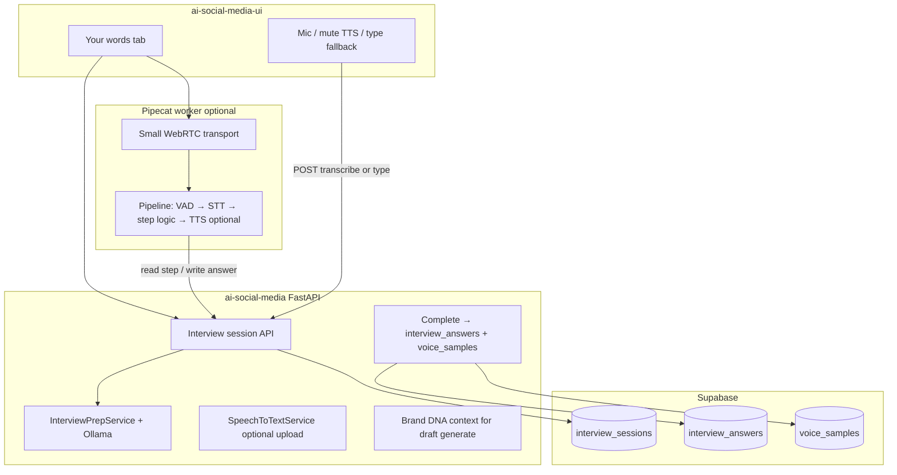

# Brand DNA — Voice stack decision & Pipecat plan

**Status:** Approved direction (2026).  
**Product context:** [BRAND_DNA_PRODUCT_SPEC.md](./BRAND_DNA_PRODUCT_SPEC.md), [BRAND_DNA_IMPLEMENTATION.md](./BRAND_DNA_IMPLEMENTATION.md).  
**Stage 1–2:** Shipped (Promise + Your words via API/UI).  
**This doc:** How we add **talk** (audio interview), without replacing our backend as source of truth.

---

## 1. Decision (locked)

| Role | Choice | Notes |
|------|--------|--------|
| **Production voice realtime** | **[Pipecat](https://docs.pipecat.ai/)** (self-hosted) | Python; Ollama + local STT/TTS; embed in product |
| **Session + data ownership** | **`ai-social-media` FastAPI + Supabase** | Prep, steps, transcript, answers — never a third-party SaaS as SoT |
| **Internal / ops experiments** | **Dograh AI** (optional, self-hosted) | Graph demos; webhook **into** our API only |
| **Telephony / scale realtime** | **LiveKit Agents** (later) | When SIP, rooms, or enterprise voice ops are required |

We do **not** use a hosted “interview copilot” as the product. Pipecat runs on **our** infrastructure next to the existing Ollama stack.

---

## 2. Why Pipecat (short)

- Matches **local-first**: Ollama (prep + optional follow-up), Whisper-class STT, optional Piper TTS ([Ollama service](https://docs.pipecat.ai/api-reference/server/services/llm/ollama)).
- **Code-first pipeline** fits the spec: cold open → prep pause → **one prepared question at a time** → silence → at most **one** follow-up → editable transcript → complete.
- **Small WebRTC** can connect the browser **Your words** tab without LiveKit-scale infra for v1.
- Dograh’s graph + pathway routing is better for call-center flows; easier to sound “HR bot” unless heavily constrained.
- LiveKit is the right upgrade path for **phone** and production turn-taking at scale, not required for first browser interview.

---

## 3. Split of responsibility



**Rule:** Pipecat never writes directly to Supabase. It calls **our** session endpoints (or an internal service token) so every row stays `user_id` + `brand_profile_id`.

---

## 4. Backend contract (session API)

Schema: `ai-social-media/sql/brand_dna_stage3_4.sql` → table `interview_sessions`.

Apply that SQL in Supabase before using these routes. Router: `routes/brand_dna_routes.py` (prefix `/brand-profiles`).

| Method | Path | Purpose |
|--------|------|---------|
| `POST` | `/{profile_id}/interview-sessions?user_id=` | Start (or resume active). Body: `cold_open_answer`. Ollama prep → `prep_brief` + `questions[]`. |
| `GET` | `/{profile_id}/interview-sessions/active?user_id=` | Active session + `stt_available`. |
| `GET` | `/{profile_id}/interview-sessions/{session_id}?user_id=` | Session by id (Pipecat sidecar refresh). |
| `POST` | `/{profile_id}/interview-sessions/{session_id}/answer?user_id=` | Save one step. Body: `question_key`, `answer_text`, `source` (`type` \| `audio`). |
| `POST` | `/{profile_id}/interview-sessions/{session_id}/transcribe?user_id=` | Multipart audio → local STT if `faster-whisper` installed; else 503. |
| `POST` | `/{profile_id}/interview-sessions/{session_id}/complete?user_id=` | Upsert answers, optional transcript sample (`source=audio`), mark `completed`. |

**Question keys** (canonical): `customers_get_wrong`, `changed_my_mind`, `unpublished_advice`, `customer_sentence`, `industry_disagree` — prep may add more keys in `questions` JSON but each key should stay unique per session.

**Related Stage 3–4 (same router):**

| Method | Path | Purpose |
|--------|------|---------|
| `POST` | `/{profile_id}/voice-study?user_id=` | Ollama keep/raise from corpus (≥3 items). |
| `GET` | `/{profile_id}/voice-study/latest?user_id=` | Latest study + corpus count. |
| `GET` | `/{profile_id}/draft-topics?user_id=` | Topic chips from answers/samples. |
| `POST` | `/{profile_id}/draft-generate` | DNA-grounded generate (needs minimum corpus). |

Stage 1–2 routes unchanged: samples, interview-answers, promise fields.

---

## 5. Pipecat integration plan (minimal slices)

### Slice A — No Pipecat (baseline, ship first)

Already aligned with spec:

- UI: type + paste + **record → POST transcribe** (or browser Web Speech → text → `source: type`).
- Backend: session start → show `prep_brief` + current question on screen → `answer` → `complete`.
- **Mute interviewer:** TTS off; questions only on screen.

**Done when:** User can finish a sitting without Pipecat installed.

### Slice B — Pipecat sidecar (recommended v1 voice)

**Goal:** Spoken questions (optional) + spoken answers with local STT, same session state in FastAPI.

1. **New package** (suggested): `ai-social-media/voice_agent/` or separate repo `ai-social-media-voice` — Pipecat process, not inside FastAPI worker thread.
2. **Config per call:** `session_id`, `profile_id`, `user_id`, `BACKEND_ORIGIN`, internal auth header (future).
3. **On connect:** `GET` active session → read `questions`, find first unanswered → bot speaks **only** `question_text` (short system prompt: quiet, no pep, no invented facts).
4. **On user utterance end (VAD):** STT → `POST .../answer` with `source: audio`.
5. **Optional follow-up:** If product allows one follow-up, set `follow_up_used` via session patch (API extension) — **max one** per spec.
6. **On pipeline end:** `POST .../complete` with full `transcript`.
7. **Transport:** [Small WebRTC](https://docs.pipecat.ai/api-reference/server/services/transport/small-webrtc) from **Your words** “Talk” panel; Next.js opens client to sidecar URL (env `PIPECAT_SIGNALING_URL`).

**Suggested local stack**

| Piece | Default |
|-------|---------|
| LLM (prep only) | Existing `InterviewPrepService` + Ollama in API — Pipecat does **not** re-prep |
| LLM (follow-up, if any) | Ollama via `OLLamaLLMService`, temperature low, prompt scoped to last answer |
| STT | Whisper via Pipecat or API `transcribe` with `faster-whisper` |
| TTS | Piper or off (user enables “read questions aloud”) |
| VAD | Pipecat default |

**Env (API, already partially documented in `.env.example`):**

```env
# Optional upload STT on API
# WHISPER_MODEL_SIZE=base
# WHISPER_DEVICE=cpu

# Pipecat sidecar (Slice B)
# PIPECAT_HOST=127.0.0.1
# PIPECAT_PORT=7860
# PIPECAT_PUBLIC_URL=ws://127.0.0.1:7860
```

### Slice C — Hardening (after Slice B works)

- Session token: short-lived JWT tying WebRTC room to `user_id` + `session_id`.
- Time cap: 10 minutes; idle timeout.
- Metrics: latency STT, time per question (no user-facing “AI score”).
- LiveKit evaluation only if Slice B WebRTC is insufficient (NAT, mobile, telephony).

---

## 6. UI wiring (when implementing Slice A/B)

Files started (may be local until pushed): `src/lib/api/brand-dna.ts`, `src/types/brand-dna.ts`.

| UI area | Behavior |
|---------|----------|
| **Your words** | Talk panel: cold open → start session → show prep + question → record/type → complete → refresh samples/answers |
| **Your words** | “Study me” → `voice-study` (Stage 3) after ≥3 corpus items |
| **Draft tab** | Unlock when readiness rules match product; topics from `draft-topics`; generate via `draft-generate` |
| **Create** | Prefer `draft-generate` when brand `ready`; else block with copy pointing to Your words |

Do not expose “Pipecat”, “LiveKit”, or model names in UI copy.

---

## 7. Dograh & LiveKit (when to reconsider)

| Tool | Use when | Do not use when |
|------|----------|-----------------|
| **Dograh** | Internal team wants to **edit** call graphs without deploy; webhook proof for sales demos | Core logged-in Brand DNA path; storing transcripts only in Dograh |
| **LiveKit** | SIP phone interviews, agent dispatch at scale, multi-participant | Browser-only v1 interview with local Ollama |

If Dograh is used: **Webhook node** → our `complete` + signed `user_id` / `brand_profile_id` in payload; treat Dograh as disposable transport.

---

## 8. Implementation order (recommended)

1. Apply `brand_dna_stage3_4.sql` in Supabase (if not done).
2. Commit/push **API** Stage 3–4 router + services (session, voice study, draft-generate).
3. **Slice A** UI: interview session flow without Pipecat.
4. **Slice B** Pipecat sidecar + WebRTC “Talk” button.
5. Wire **Draft** tab + **Create** to `draft-generate` and DNA context.
6. Stage 5 (edit learning) — separate spec slice; not part of voice stack.

---

## 9. Product tests (voice)

- Interviewer stays **quiet and specific**; no “Great insight!”
- Questions reference **only** Promise + cold open (no fake customer stories).
- User can **mute** spoken questions and **type** any answer.
- Transcript is **editable** before complete.
- Completed session lands in **their** Supabase rows, same as paste/type.
- Without local STT, user still completes via typing (503 on transcribe is OK).

---

## 10. References

- Pipecat intro: https://docs.pipecat.ai/pipecat/get-started/introduction  
- Pipecat + Ollama: https://docs.pipecat.ai/api-reference/server/services/llm/ollama  
- Dograh voice builder (optional): https://docs.dograh.com/voice-agent/introduction  
- LiveKit Agents (later): https://docs.livekit.io/agents/  

**Backend SQL:** `../ai-social-media/sql/brand_dna_stage1_2.sql`, `../ai-social-media/sql/brand_dna_stage3_4.sql`
